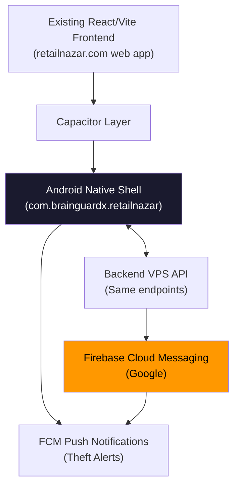

## Objective
Convert the existing Retail Nazar React/Vite web app into a native **Android app** using Capacitor — zero UI rewrite, the same codebase is reused. Submit to Google Play under **BrainGuardX AI Technologies Pvt. Ltd.**. iOS (via Codemagic cloud build) is Phase 2.

---

## Why Capacitor (not React Native / Flutter)

| Factor | Capacitor | React Native |
|---|---|---|
| Reuse existing React/Vite code | **100% — zero rewrite** | Must rebuild all screens |
| Effort | Low | Very high |
| Push notifications | Native via FCM plugin | Native via FCM |
| Live CCTV stream (HLS/WebRTC) | Works in WebView | Needs native component |
| Windows build (Android) | Yes — Android Studio | Yes |
| iOS later (no Mac) | Codemagic cloud | Codemagic cloud |

---

## Architecture



---

## Phase 1 — Android App (Current Focus)

### Step 1 — Capacitor Setup (Frontend)

**Files to create/modify:**

| File | Action | Purpose |
|---|---|---|
| `frontend/web/capacitor.config.ts` | **Create** | App ID, name, server URL |
| `frontend/web/package.json` | **Edit** | Add `@capacitor/core`, `@capacitor/cli`, `@capacitor/android` |
| `frontend/web/android/` | **Auto-generated** | Native Android project |

**`capacitor.config.ts` configuration:**
```ts
appId: 'com.brainguardx.retailnazar'
appName: 'Retail Nazar'
webDir: 'dist'
server: { url: 'https://retailnazar.com' }  // live server mode
```

> Using **live server mode** means the app always loads the latest web version from the VPS — no need to re-submit to Play Store for most updates.

---

### Step 2 — Push Notifications (Theft Alerts on Phone)

**Plugin:** `@capacitor/push-notifications` → Firebase Cloud Messaging (FCM)

**What gets built:**

| Component | Change |
|---|---|
| Frontend | Register FCM token on login; send token to backend |
| Backend | New endpoint `POST /api/devices/register` saves token |
| Backend | Camera worker fires FCM push when theft alert fires |
| Firebase | Create project, add Android app, download `google-services.json` |

**Notification payload on theft detection:**
```json
{
  "title": "🚨 Alert — Store: Ramesh Electronics",
  "body": "Suspicious activity at Camera 3 — sweeping detected",
  "data": { "camera_id": "cam-003", "event": "shoplifting" }
}
```

---

### Step 3 — Mobile UI Adjustments (Minimal)

The existing web app runs inside a native WebView. Small additions needed:

| Item | Change |
|---|---|
| Status bar | Dark theme via `@capacitor/status-bar` |
| Splash screen | BrainGuardX logo via `@capacitor/splash-screen` |
| Safe area | Add CSS `env(safe-area-inset-*)` padding for Android notch |
| Back button | Hardware back button handling on Android |
| Role routing | No change — existing login → admin vs. customer routing works as-is |

---

### Step 4 — App Assets (Required for Play Store)

| Asset | Spec |
|---|---|
| App icon | 1024×1024 PNG (adaptive icon for Android) |
| Feature graphic | 1024×500 PNG (Play Store banner) |
| Phone screenshots | Min 2, up to 8 (1080×1920 or similar) |
| Short description | 80 characters max |
| Full description | Up to 4,000 characters |
| Privacy policy URL | `https://retailnazar.com/privacy` (must create this page) |
| Data safety form | Declares: email, camera footage, location (store) |

---

### Step 5 — Build Signed AAB (Android Studio on Windows)

```bash
# In frontend/web:
npm install
npm run build          # Creates dist/
npx cap sync android   # Copies dist → android/app/src/main/assets
npx cap open android   # Opens Android Studio
```

In Android Studio:
- Build → Generate Signed Bundle (AAB format — required by Play Store)
- Create keystore (keep this file safe — needed for all future updates)
- Min SDK: Android 7.0 (API 24) — covers 99%+ of Indian Android users
- Target SDK: Android 14 (API 34) — required for Play Store new submissions

---

### Step 6 — Google Play Submission (Account already set up)

| Step | Action |
|---|---|
| 6a | Create app in Play Console → "Retail Nazar - Store Security" |
| 6b | Upload AAB to Internal Testing track first |
| 6c | Fill app listing (description, screenshots, feature graphic) |
| 6d | Complete data safety section (camera data, account data) |
| 6e | Set content rating (Everyone) |
| 6f | Set price: Free (subscription is in-app via Razorpay) |
| 6g | Promote to Production track → Submit for review |
| **Review time** | **Typically 3–7 days for new apps** |

**Developer name on Play Store:** BrainGuardX AI Technologies Pvt. Ltd.  
**App category:** Business → Security  
**Countries:** India (all states)

---

## Phase 2 — iOS App (After Android is live)

Since you have an Apple Developer Account but no Mac:

| Step | Tool |
|---|---|
| iOS project generation | `npx cap add ios` (same codebase) |
| Cloud build | **Codemagic** (free tier available, connects to GitHub, builds IPA on Mac server) |
| Distribution | TestFlight (beta) → App Store |
| Cost | Codemagic free tier: 500 min/month (enough for builds) |
| Review time | 1–7 days (Apple is stricter than Google) |

---

## Backend Changes Summary

| File | Change |
|---|---|
| `backend/routers/devices.py` | **New** — FCM token register/unregister endpoint |
| `backend/models.py` | Add `DeviceToken` model (user_id, token, platform, created_at) |
| `backend/agent/camera_worker.py` | Add FCM push call after existing WhatsApp/email alert |
| `backend/requirements.txt` | Add `firebase-admin` |

---

## Files To Create/Modify

### Frontend
- `frontend/web/capacitor.config.ts` ← new
- `frontend/web/package.json` ← add 4 Capacitor packages
- `frontend/web/src/main.tsx` ← add FCM token registration on login
- `frontend/web/android/` ← auto-generated by `npx cap add android`
- App icons (generated from logo)

### Backend
- `backend/routers/devices.py` ← new
- `backend/models.py` ← add DeviceToken table
- `backend/agent/camera_worker.py` ← 10 lines for FCM push
- `backend/requirements.txt` ← +1 package

---

## Privacy Policy Page (Required for Both Stores)

A `/privacy` page must exist at `retailnazar.com/privacy` covering:
- What data is collected (email, store camera footage metadata, device token)
- How it is stored (India-based VPS)
- Contact: support@retailnazar.com
- Company: BrainGuardX AI Technologies Pvt. Ltd.

---

## Step → Target → Verification

| Step | File(s) | Verification |
|---|---|---|
| S1 Capacitor install | `package.json`, `capacitor.config.ts` | `npx cap doctor` → no errors |
| S2 Android project | `android/` folder | `npx cap open android` opens Android Studio |
| S3 Firebase setup | `android/app/google-services.json` | FCM test notification received on device |
| S4 App assets | Icons, screenshots | Play Console preview shows correct branding |
| S5 Signed AAB | `app-release.aab` | File size ~5MB, installs on Android test device |
| S6 Play Store | Internal testing track | Testers can install from Play Store link |
| S7 Production | Production track | Appears in Play Store search for "Retail Nazar" |

---

## Definition of Done (Phase 1)
- App installable from Google Play Store on Android 7.0+
- Login works (shop owner and admin roles)
- Live camera feed visible in app
- Push notification received on phone within 30s of a theft alert
- Footfall analytics dashboard renders correctly on mobile screen
- App listed under **BrainGuardX AI Technologies Pvt. Ltd.**

---

## What You Need to Arrange (before/during implementation)
1. **Firebase project** — create free at console.firebase.google.com → add Android app → download `google-services.json`
2. **Keystore password** — you generate this during the signing step; store it safely (losing it = cannot update the app ever)
3. **Privacy policy page** — I will create this as part of the plan
4. **Play Store screenshots** — I will generate these from the live site
